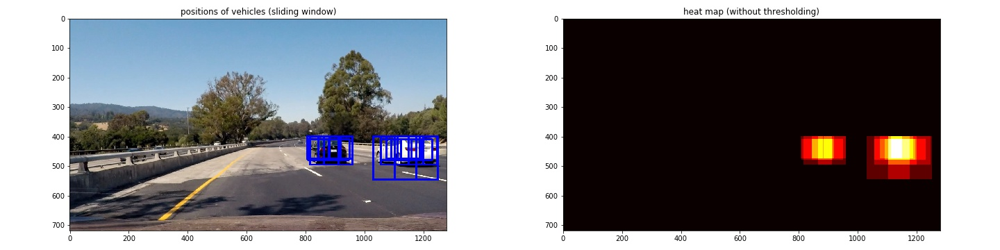

<!-- ## Writeup Template
### You can use this file as a template for your writeup if you want to submit it as a markdown file, but feel free to use some other method and submit a pdf if you prefer.

--- -->

# Project: Vehicle Detection and Tracking

## 1. Overview
In this project, we build a pipeline for detecting vehicles in images
and videos of roads captured by a camera attached to a car.
For this purpose, we first construct a model for classifying vehicle and non-vehicle
images based on Support Vector Machine (SVM) algorithm.
The features used for our classification model are extracted
by combining some feature extraction methods including Histogram of Oriented Gradients (HOG).
We then apply a sliding window method with this classification model to
detect the location of the vehicles in the images and videos of car roads. Some extra techniques
are also introduced to remove false positives.   

We note that the section numbers in this write-up match
with those in `Vehicle_Detection.ipynb` where Python codes for this project are
given (for example, HOG feature extraction is explained in Section 2.1.1
of this write-up and the corresponding code is given in Section 2.1.1 of `Vehicle_Detection.ipynb`).

## 2. Feature Extraction and Model Building
For building a pipeline for vehicle detection and tracking, we
construct a model to classify vehicle and non-vehicle images.
In this project, we use 8792
[vehicle images](https://s3.amazonaws.com/udacity-sdc/Vehicle_Tracking/vehicles.zip)
and 8968 [non-vehicle images](https://s3.amazonaws.com/udacity-sdc/Vehicle_Tracking/non-vehicles.zip)
provided by Udacity for training our model for classifying vehicles/non-vehicles images.
Each image is a 64x64 color image (i.e. 3 channels).  Examples are displayed below:

  

<!--  -->

### 2.1. Feature Extraction
The first step towards the model building is to extract a set of features from the images.
For this purpose, we combine three feature extraction methods. We explain
these three methods separately as well as how to combine them in the rest of this subsection.

#### 2.1.1. Feature Extraction with Histogram of Oriented Gradients (HOG)
The first method for extracting features is to use Histogram of Oriented Gradients (HOG).
We used `hog()` function in `skimage` library to define a function `get_hog_features()`
which returns the HOG features of a given image. Examples of HOG images
obtained by applying `get_hog_features()` to Y-channel of vehicle and non-vehicle
images in YCrCb color space are given below (as seen below, we will use YCrCb
color space when we build a classification model):

Here the parameters for HOG are set to `orient` = (# of orientation) = 8,
`pix_per_cell` = (# of pixels per cell in row/column) = 16
and `cell_per_block` = (# of cells per block in row/column) = 2.

We will explain how/why we chose these parameters for the feature extraction
in the end of this subsection.

#### 2.1.2. Features from Histogram of Color
The second method we used for the feature extraction is the histogram of color
(i.e. for a given channel, we count the number of pixels which take values in a given
range and then create a histogram). This is implemented as the `function color_hist()`.
An example of the histograms of color is given below:

Here for each channel of an `YCrCb` color image, a histogram is drawn by setting the bin size
`hist_bins = 16` (note that here each pixel in a given channel is normalized
such that it takes an integer value in [0, 255]).  

#### 2.1.3. Feature Extraction with Spatial Binning
The third method for the feature extraction is to use spatial binning of color.
This is implemented in the function `bin_spatial()` (i.e. an image is spatially
binned by `resize()` in OpenCV `cv2` library and the value of
each entry in each channel after the resizing is used as a single feature).
An example of the spatial binning applied to an RGB color image is given below:

Here the spatial size after the spatial binning is set to
`spatial_size = (16, 16)` and `YCrCb` color space is used.
In the right figure, the value of each entry after the spatial binning is plotted
(note that here each entry takes a value in [0, 1]).

#### 2.1.4. Combining Feature Extractions

For building the model for classifying vehicle and non-vehicle images,
we combined the above three feature extraction methods as follows:

- We first converted an RGB color image into `YCrCb` color space.  
- We then applied to the converted image
  - HOG method to all the three channels (Y, Cr and Cb). The parameters are set to
    `orient = 8`, `pix_per_cell = 16` and `cell_per_block = 2`.
  - Histogram of Color method with the bin size `hist_bins = 16`.
  - Spatial Binning method with the spatial size `spatial_size = (16, 16)`.

This extracts **1680 features** in total from a 64x64 color image. From this,
a single feature vector is created for each image. This is implemented
in the function `extract_features()`.

Some comments are in order about how/why we reached this way of feature extraction
(please refer to the next subsection for the detail of our model building for
vehicle/non-vehicle classification):

- We tried classification models with HOG feature extraction only and those with the
three extraction methods combined. The latter showed higher accuracy and thus
we used the combination of the three feature extraction methods for our model building.
- For the choice of the color space we tried some other color spaces including
the standard RGB color space. The models with `YCrCb` resulted in the highest accuracy.
- For the choice of `hist_bins` for Histogram of Color method and `spatial_size`
for Spatial Binning method, we have chosen the small values
(for somehow high speed classification) with which the model achieves more than 0.985
test accuracy for classification.
- For the parameters of HOG,
we tried various combinations and finally chose the above values,
since this combination leads to a relatively small number
of features (especially, the large value of `pix_per_cell` helps for this purpose)
and at the same time achieves a high test accuracy (> 0.985) for classification.

### 2.2. Model Building

Once the way to extract features is determined, we used this to
generate a training and test set for our model building. This can be done
by applying `extract_features()` to the vehicle/non-vehicle images.
We then labeled to distinguish the vehicle and non-vehicle images,
shuffled and split into the training set (80% of the total images)
and the test set (20%). Since we combined the three methods for the
feature extractions, the value ranges can differ a lot for different features.
We thus used `StandardScaler()` in `sklearn` library to scale the
features such that the value ranges of different features
are not too different.  

Once the training and test data set are generated, we used
**Support Vector Machine (SVM) algorithm with
a linear kernel** for building our classification model.
Our model is denoted by `svc` ( vector classifier)
in `Vehicle_Detection.ipynb`. Our model achieved **0.9999** accuracy for the training set
and **0.9899** accuracy for the test set.

## 3. Finding Vehicle

By using our classification model `svc`, here we create the pipeline
for vehicle detection applicable to videos of roads.
In the middle of this process, we use the images of the roads
in the folder `test_images` to check the performance of parts of our pipeline.

### 3.1. Sliding Window Search
In an image of a road, a vehicle is located in some part of the image
(i.e. an image is not fully occupied by a single vehicle).
On top of this, more than one vehicles can be located in the image.
To detect vehicles in the image of the road, we used the sliding window search
(Hog sub-sampling window search more precisely) which is implemented
in the function `find_vehicles()`.
This function takes a search region between `y = ystart` and `y = ystop`
and slides a window with size `(64*scale)x(64*scale)` within it.
The image inside each window is rescaled to 64x64 (which is equivalent to
the image size used for building our classification model `svc`) and our classification
model `svc` is applied to judge if a vehicle is located in the window or not.

We note that, because of the perspective, depending on the value of
the vertical coordinate y, a size of a vehicle in the image is very different (for a small/large y,
a vehicle is small/large since the vehicle is far from/close to the camera). It is
thus important to do the multiple window search, i.e. to combine
the sliding window searches with different windows sizes and different search regions.
Especially it is important to use a small size window in the small y region
and a large size window in the large y region.
After a lot of trials, we combined the sliding window searches
with the following 4 different parameter sets:
`(ystart, ystop, scale, cells_per_step) = (400, 500, 1.5, 2), (400, 480, 1.2, 2),
(400, 620, 2.3, 2), (410, 500, 1.1, 2)`. Here we chose the number of the parameter
sets to be as small as we can, since the use of a large number of the parameter sets leads to
a drastic slow down of our pipeline for vehicle detection.
Examples of the results with the searches combined are shown below:

example 1

  

example 2

  

<!--  -->

In the first example, we can see the false positive detection in the middle
of the image. In the next part we introduce a method to remove false positives.
### 3.2. Heat Map

The sliding window search implemented above returns the locations of boxes
inside of which our classification model detected vehicles.
Even the parameters for the search are chosen carefully, as can be
seen in the first example above,
this simple method in general end up with the detection with several false positives.
We thus need to apply some methods to decrease the number of the false positives.
On top of this, when multiple vehicles are located in the image, we need
to identify which boxes correspond to which vehicles.
For these purposes, we used the heat map.
We computed the heat map by counting how many times a vehicle is detected in a given pixel
(i.e. when a given pixel is contained in 3 detected windows, for example,
then the value at this pixel in the heat map is 3). This is done by the function
`add_heat()`. We then imposed a threshold on the value in the heat map by using
another function `apply_threshold()`. We set threshold to be `heat_threshold = 2`
(this means that more than 2 windows must detect a vehicle in this pixel in order
to be judged that a vehicle is detected there).
The detected location(s) of
the vehicle(s) is determined based on this thresholded heat map by using
the function `label()` in `scipy` library. The final bounding box for the
detected vehicles can be visualized by using `draw_labeled_bboxes()`.

To reduce the number of the false positives further, in `draw_labeled_bboxes()`,
we also neglected the bounding boxes with area smaller than 2500 pixel squared.
(The vehicles that can be located in the bottom half of images is greater than this.
We will discuss this point in the final section of this write-up).
This helps to reduce the number of the false positives
when we apply our pipeline to videos.

Examples of the sliding window
search combined with the thresholding based on the heat map are given below:

example 1

example 2

In each example, the upper left image contains the boxes detected by the sliding window search (with
the multiple parameter sets as above) and the upper right image is the heat map created
from it (no thresholding  imposed in the visualization).
The bottom left image is the output of `label()` in `scipy` library (with
the thresholded heat map as an input) and the bottom right image is the final bounding box
for the detected vehicles obtained by using `draw_labeled_bboxes()`.

### 3.3. Pipeline for Video
By combining the above, we built the pipeline of the vehicle detection
applicable to videos. This is implemented in the function `pipeline_video()`.
The detail of what this function does is as follow:

- Use `find_vehicles()` to do the sliding window search for vehicles in
each time frame for each parameter set `(ystart, ystop, scale, cells_per_step)`
defined as above.
- Then the average of the outputs of `add_heat()` for `20`
recent time frames is computed to create a heat map.
By applying to this the thresholding `apply_threshold()`
and then `draw_labeled_bboxes()` to this heat map, the bounding boxes for
the detected vehicles are displayed on each time frame of the video.

The averaging over some past time frames helps to remove the false positive detections
in the end of the pipeline. To save the value of the
heat maps in the previous time frames, we created a class `record_heat`.
(`record_heat.hist_size = 20` denotes how many recent time frames we save
and use for the pipeline.)

## 4. Performance
Finally, we applied our pipeline
implemented in `pipeline_video()` to the video `project_video.mp4` provided by
[Udacity](https://github.com/udacity/CarND-Vehicle-Detection).
The result of vehicle detection is saved in `project_output.mp4` where the detected vehicles
are surrounded by blue boxes. This video is also available [here](https://youtu.be/QgNBR6WHYkY). This output
video shows that our pipeline works well for the vehicle detection.

## 5. Summary and Discussion

In this project, we built a pipeline for detecting and tracking vehicles in
videos of roads. Our result in the previous section shows that our pipeline
works well for this purpose.

Here we discuss potential issues and improvements of our pipline:

- When we designed our pipeline for the vehicle detection, we took
the speed for the detection into consideration.
Because of this, we used a small number of features
(while keeping a decently high accuracy (>98.5%) for `svc` classifier). In the
sliding window search, we also combined only 4 different parameter sets. This
simple pipeline however leads to some false positive detections even after the heat map
is implemented for thresholding. In the above, within the function `draw_labeled_bboxes()`
we thus imposed a threshold on the area of the bounding windows
to reduce the number of the false positive further. Because of this, when a very
small vehicle (say Smart Car for example) is on the road, then our pipeline might fail to detect it.
To remove or relax this threshold on the area and avoid false positives at the same time,
the simplest way is to use more features and more parameter sets for the sliding window
search. To carry out fast vehicle detection with such more complicated pipelines,
we need more numerical resources (we ran our codes in the jupyter notebook
on MacBook with 1.1 GHz Intel Core m3 processor).
- In our pipeline, we used the heat maps of the last 20 time frames for the vehicle detection.
This works when a vehicle to detect does not move too fast in the video
(in such a case, the heat map do not change in a short time duration).
However, when the vehicle to detect goes very fast,
the bounding box obtained by our pipeline can delay (i.e. it displays the past location
of the vehicle). To avoid this, we must set `record_heat.hist_size` to a smaller value.
This however increases false positives. Again, to consider a more complicated pipeline
as mentioned above is one straightforward way to reduce the false positives.
- We tried to simplified our pipeline, but still it take too much time for
real time detection (about 11 minutes to process 50 second with my Macbook,
about 5 minutes with iMac with 3.2 GHz Intel i5 processor). One possible
way to improve the speed is to restrict the region to do the sliding
window search. In our pipeline, we did not restrict the region in the horizontal
x direction. Implementing this restriction will speed up our pipeline and,
at the same time, reduce the number of the false positives that often show up
because of something near the boundary of the image (guard rail, tree, shade, wall etc.).

<!-- ---
The goals / steps of this project are the following:

* Perform a Histogram of Oriented Gradients (HOG) feature extraction on a labeled training set of images and train a classifier Linear SVM classifier
* Optionally, you can also apply a color transform and append binned color features, as well as histograms of color, to your HOG feature vector.
* Note: for those first two steps don't forget to normalize your features and randomize a selection for training and testing.
* Implement a sliding-window technique and use your trained classifier to search for vehicles in images.
* Run your pipeline on a video stream (start with the test_video.mp4 and later implement on full project_video.mp4) and create a heat map of recurring detections frame by frame to reject outliers and follow detected vehicles.
* Estimate a bounding box for vehicles detected.

[//]: # (Image References)
[image1]: ./examples/car_not_car.png
[image2]: ./examples/HOG_example.jpg
[image3]: ./examples/sliding_windows.jpg
[image4]: ./examples/sliding_window.jpg
[image5]: ./examples/bboxes_and_heat.png
[image6]: ./examples/labels_map.png
[image7]: ./examples/output_bboxes.png
[video1]: ./project_video.mp4

## [Rubric](https://review.udacity.com/#!/rubrics/513/view) Points
### Here I will consider the rubric points individually and describe how I addressed each point in my implementation.  

---
### Writeup / README

#### 1. Provide a Writeup / README that includes all the rubric points and how you addressed each one.  You can submit your writeup as markdown or pdf.  [Here](https://github.com/udacity/CarND-Vehicle-Detection/blob/master/writeup_template.md) is a template writeup for this project you can use as a guide and a starting point.  

You're reading it!

### Histogram of Oriented Gradients (HOG)

#### 1. Explain how (and identify where in your code) you extracted HOG features from the training images.

The code for this step is contained in the first code cell of the IPython notebook (or in lines # through # of the file called `some_file.py`).  

I started by reading in all the `vehicle` and `non-vehicle` images.  Here is an example of one of each of the `vehicle` and `non-vehicle` classes:

![alt text][image1]

I then explored different color spaces and different `skimage.hog()` parameters (`orientations`, `pixels_per_cell`, and `cells_per_block`).  I grabbed random images from each of the two classes and displayed them to get a feel for what the `skimage.hog()` output looks like.

Here is an example using the `YCrCb` color space and HOG parameters of `orientations=8`, `pixels_per_cell=(8, 8)` and `cells_per_block=(2, 2)`:

![alt text][image2]

#### 2. Explain how you settled on your final choice of HOG parameters.

I tried various combinations of parameters and...

#### 3. Describe how (and identify where in your code) you trained a classifier using your selected HOG features (and color features if you used them).

I trained a linear SVM using...

### Sliding Window Search

#### 1. Describe how (and identify where in your code) you implemented a sliding window search.  How did you decide what scales to search and how much to overlap windows?

I decided to search random window positions at random scales all over the image and came up with this (ok just kidding I didn't actually ;):

![alt text][image3]

#### 2. Show some examples of test images to demonstrate how your pipeline is working.  What did you do to optimize the performance of your classifier?

Ultimately I searched on two scales using YCrCb 3-channel HOG features plus spatially binned color and histograms of color in the feature vector, which provided a nice result.  Here are some example images:

![alt text][image4]
---

### Video Implementation

#### 1. Provide a link to your final video output.  Your pipeline should perform reasonably well on the entire project video (somewhat wobbly or unstable bounding boxes are ok as long as you are identifying the vehicles most of the time with minimal false positives.)
Here's a [link to my video result](./project_video.mp4)

#### 2. Describe how (and identify where in your code) you implemented some kind of filter for false positives and some method for combining overlapping bounding boxes.

I recorded the positions of positive detections in each frame of the video.  From the positive detections I created a heatmap and then thresholded that map to identify vehicle positions.  I then used `scipy.ndimage.measurements.label()` to identify individual blobs in the heatmap.  I then assumed each blob corresponded to a vehicle.  I constructed bounding boxes to cover the area of each blob detected.  

Here's an example result showing the heatmap from a series of frames of video, the result of `scipy.ndimage.measurements.label()` and the bounding boxes then overlaid on the last frame of video:

### Here are six frames and their corresponding heatmaps:

![alt text][image5]

### Here is the output of `scipy.ndimage.measurements.label()` on the integrated heatmap from all six frames:
![alt text][image6]

### Here the resulting bounding boxes are drawn onto the last frame in the series:
![alt text][image7]

---

### Discussion

#### 1. Briefly discuss any problems / issues you faced in your implementation of this project.  Where will your pipeline likely fail?  What could you do to make it more robust?

Here I'll talk about the approach I took, what techniques I used, what worked and why, where the pipeline might fail and how I might improve it if I were going to pursue this project further.   -->
